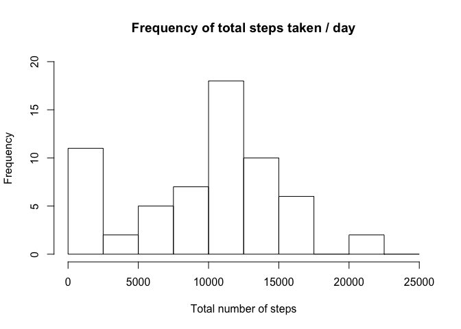
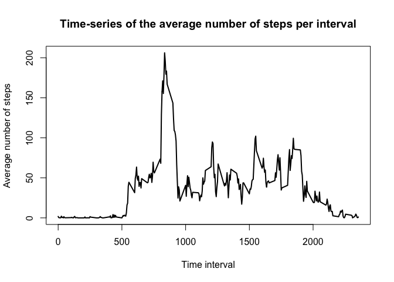
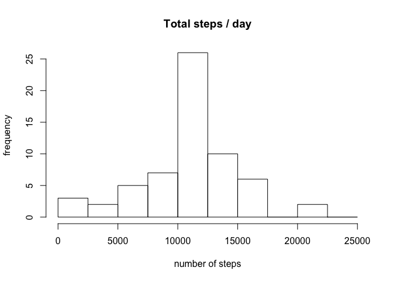

# Reproducible Research: Peer Assessment 1
## Introduction

It is now possible to collect a large amount of data about personal
movement using activity monitoring devices such as a
[Fitbit](http://www.fitbit.com), [Nike
Fuelband](http://www.nike.com/us/en_us/c/nikeplus-fuelband), or
[Jawbone Up](https://jawbone.com/up). These type of devices are part of
the "quantified self" movement -- a group of enthusiasts who take
measurements about themselves regularly to improve their health, to
find patterns in their behavior, or because they are tech geeks. But
these data remain under-utilized both because the raw data are hard to
obtain and there is a lack of statistical methods and software for
processing and interpreting the data.

This assignment makes use of data from a personal activity monitoring
device. This device collects data at 5 minute intervals through out the
day. The data consists of two months of data from an anonymous
individual collected during the months of October and November, 2012
and include the number of steps taken in 5 minute intervals each day.

## Data

The data for this assignment can be downloaded from the course web
site:

* Dataset: [Activity monitoring data](https://d396qusza40orc.cloudfront.net/repdata%2Fdata%2Factivity.zip) [52K]

The variables included in this dataset are:

* **steps**: Number of steps taking in a 5-minute interval (missing
    values are coded as `NA`)

* **date**: The date on which the measurement was taken in YYYY-MM-DD
    format

* **interval**: Identifier for the 5-minute interval in which
    measurement was taken
    
## Giddy up

## Loading and preprocessing the data
1. Load the data

```r
data <- read.csv("activity.csv", header = TRUE)
data_df <- data.frame(data)
```
2. Format date and time 

```r
data_df$date <- as.Date(data_df$date, "%Y-%m-%d")
head(data_df)
```

```
##   steps       date interval
## 1    NA 2012-10-01        0
## 2    NA 2012-10-01        5
## 3    NA 2012-10-01       10
## 4    NA 2012-10-01       15
## 5    NA 2012-10-01       20
## 6    NA 2012-10-01       25
```
## What is mean total number of steps taken per day?

```r
# Sum steps each day
data_total_steps <- aggregate(data_df$steps, by=list(data_df$date), FUN=sum, na.rm=TRUE)

# Rename the attributes
names(data_total_steps) <- c("date", "total")

# Frequency of steps / day
hist(data_total_steps$total, 
     breaks=seq(from=0, to=25000, by=2500),
     xlab="Total number of steps", 
     ylim=c(0, 20), 
     main="Frequency of total steps taken / day")
```

 

```r
# Mean of total daily steps taken
mean(data_total_steps$total)
```

```
## [1] 9354.23
```

```r
# Median of total daily steps taken
median(data_total_steps$total)
```

```
## [1] 10395
```
## What is the average daily activity pattern?
1. Make a time series plot (i.e. type = "l") of the 5-minute interval (x-axis) and the average number of steps taken, averaged across all days (y-axis)

```r
# Compute the means of steps accross all days for each interval
dataMean <- aggregate(data_df$steps, 
                       by=list(data_df$interval), 
                       FUN=mean, 
                       na.rm=TRUE)

# Rename the attributes
names(dataMean) <- c("interval", "mean")
```
Now to create the time series plot

```r
# Compute the time series plot
plot(dataMean$interval, 
     dataMean$mean, 
     type="l", 
     lwd=2, 
     xlab="Time interval", 
     ylab="Average number of steps", 
     main="Time-series of the average number of steps per interval")
```

 

2. Which 5-minute interval, on average across all the days in the dataset, contains the maximum number of steps?

```r
# We find the position of the maximum mean
maximum <- which(dataMean$mean == max(dataMean$mean))

# We lookup the value of interval at this position
max_interval <- dataMean[maximum, 1]
max_interval
```

```
## [1] 835
```
## Imputing missing values
1. Calculate and report the total number of missing values in the dataset (i.e. the total number of rows with NAs)

```r
totalNAs <- sum(is.na(data_df$steps))
```
2. Devise a strategy for filling in all of the missing values in the dataset. The strategy does not need to be sophisticated. For example, you could use the mean/median for that day, or the mean for that 5-minute interval, etc.

```r
StepsAverage <- aggregate(steps ~ interval, data = data_df, FUN = mean)
replaceNA <- numeric()
for (i in 1:nrow(data_df)) {
    obs <- data_df[i, ]
    if (is.na(obs$steps)) {
        steps <- subset(StepsAverage, interval == obs$interval)$steps
    } else {
        steps <- obs$steps
    }
    replaceNA <- c(replaceNA, steps)
}
```
3. Create a new dataset that is equal to the original dataset but with the missing data filled in.

```r
new_data_df <- data_df
new_data_df$steps <- replaceNA
```

4. Make a histogram of the total number of steps taken each day and Calculate and report the mean and median total number of steps taken per day. Do these values differ from the estimates from the first part of the assignment? What is the impact of imputing missing data on the estimates of the total daily number of steps?

```r
data_total_steps_new <- aggregate(steps ~ date, data = new_data_df, sum, na.rm = TRUE)
hist(data_total_steps_new$steps, breaks=seq(from=0, to=25000, by=2500), main ="Total steps / day", xlab = "number of steps", ylab = "frequency" )
```

 

The new mean and median with NA values removed are:

```r
mean(data_total_steps_new$steps)
```

```
## [1] 10766.19
```

```r
median(data_total_steps_new$steps)
```

```
## [1] 10766.19
```
## Are there differences in activity patterns between weekdays and weekends?
1. Create a new factor variable in the dataset with two levels – “weekday” and “weekend” indicating whether a given date is a weekday or weekend day.


```r
day <- weekdays(new_data_df$date)
daylevel <- vector()
for (i in 1:nrow(new_data_df)) {
    if (day[i] == "Saturday") {
        daylevel[i] <- "Weekend"
    } else if (day[i] == "Sunday") {
        daylevel[i] <- "Weekend"
    } else {
        daylevel[i] <- "Weekday"
    }
}
new_data_df$daylevel <- daylevel
new_data_df$daylevel <- factor(new_data_df$daylevel)

stepsByDay <- aggregate(steps ~ interval + daylevel, data = new_data_df, mean)
names(stepsByDay) <- c("interval", "daylevel", "steps")
```
2. Make a panel plot containing a time series plot (i.e. type = "l") of the 5-minute interval (x-axis) and the average number of steps taken, averaged across all weekday days or weekend days (y-axis). See the README file in the GitHub repository to see an example of what this plot should look like using simulated data.


```r
library(lattice)
xyplot(steps ~ interval | daylevel, stepsByDay, type = "l", layout = c(1, 2), 
    xlab = "Interval", ylab = "Number of steps")
```

 


